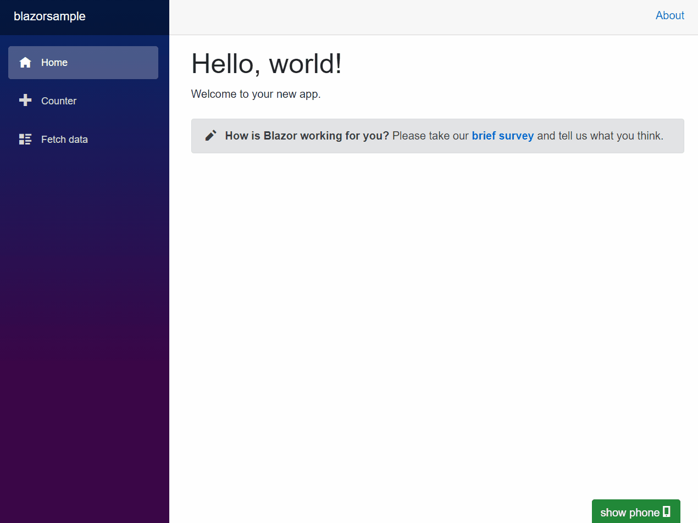

# Twilio Blazor Phonecalls

**Read the following Twilio Tutorial to learn how to create this application: [Making Phone Calls from Blazor WebAssembly with Twilio Voice](https://www.twilio.com/blog/making-phone-calls-from-blazor-webassembly-with-twilio-voice).**    

This application demonstrates how to create a Dialer Blazor WASM component to make phone calls from the browser using Twilio's Programmable Voice service.
The application has been split up into two projects:
- Client: Responsible for rendering the UI and initiating/receiving the voice calls using Twilio's Client JS SDK
- Server: Responsible for generating auth tokens and handling Twilio webhooks to instruct what to do with outgoing/incoming voice calls.

Ideally the server would be split into two project, one for generating auth tokens and one for handling webhooks.
This would allow you to host your auth server on a private network while stil exposing the webhooks publicly.
To keep the demo simple, these two responsiblities have been rolled into one server project.
You should also add authentication and authorization logic to the token endpoint so only the people that should be able to make calls can fetch the tokens.

This project has been built using .NET Core 3.1, but an additional branch is available with [.NET 5 which uses the newly introduced capabilities](https://github.com/Swimburger/TwilioBlazorPhonecalls/tree/dotnet-5).

Another branch has been provided "[voice-mail-fallback](https://github.com/Swimburger/TwilioBlazorPhonecalls/tree/voice-mail-fallback)" incase you're interested in a graceful fallback in case nobody picks up the voice call. This fall back will read a message to the user and record the conversation as a voicemail.

Here's a preview GIF of what the project looks like:

